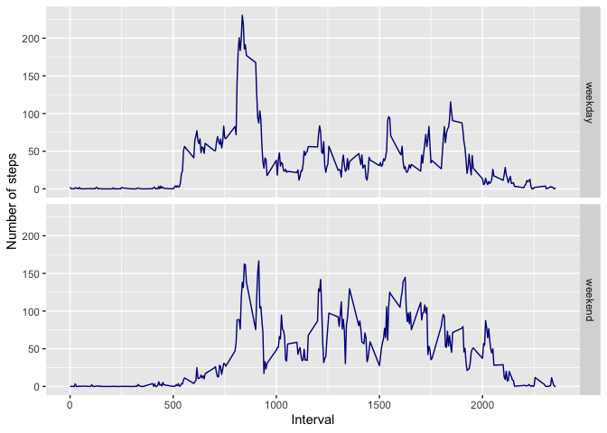

It is now possible to collect a large amount of data about personal movement using activity monitoring devices such as a Fitbit, Nike Fuelband, or Jawbone Up. These type of devices are part of the "quantified self" movement -- a group of enthusiasts who take measurements about themselves regularly to improve their health, to find patterns in their behavior, or because they are tech geeks. But these data remain under-utilized both because the raw data are hard to obtain and there is a lack of statistical methods and software for processing and interpreting the data.

This assignment makes use of data from a personal activity monitoring device. This device collects data at 5 minute intervals through out the day. The data consists of two months of data from an anonymous individual collected during the months of October and November, 2012 and include the number of steps taken in 5 minute intervals each day.


## Loading and preprocessing the data
First, we load the data using the read_csv in the package "readr" and then we process the data.


```r
library(readr)
activity <- read_csv("~/Desktop/datasciencecoursera/Reproducible Research/activity.csv")
```

```
## Parsed with column specification:
## cols(
##   steps = col_double(),
##   date = col_date(format = ""),
##   interval = col_double()
## )
```

```r
library(dplyr)
```

```
## 
## Attaching package: 'dplyr'
```

```
## The following objects are masked from 'package:stats':
## 
##     filter, lag
```

```
## The following objects are masked from 'package:base':
## 
##     intersect, setdiff, setequal, union
```

```r
daily_steps <- activity %>%
  mutate(day = as.Date(date, format="%Y-%m-%d")) %>%
  group_by(day) %>% 
  summarise(total_steps=sum(steps)) %>% 
  na.omit()
```

```
## `summarise()` ungrouping output (override with `.groups` argument)
```

```r
daily_mean_steps <- activity %>%
  mutate(day = as.Date(date, format="%Y-%m-%d")) %>%
  group_by(day) %>%
  summarise(mean=mean(steps, na.rm = TRUE)) %>% 
  na.omit()
```

```
## `summarise()` ungrouping output (override with `.groups` argument)
```

```r
daily_median_steps <- activity %>%
  mutate(day = as.Date(date, format="%Y-%m-%d")) %>%
  group_by(day) %>% 
  summarise(median=median(steps, na.rm = TRUE))  %>% 
  na.omit()
```

```
## `summarise()` ungrouping output (override with `.groups` argument)
```

```r
minute_steps <- activity %>%
  mutate(interval = as.factor(as.character(interval))) %>%
  group_by(interval) %>% 
  summarise(mean_steps=mean(steps, na.rm = TRUE))  
```

```
## `summarise()` ungrouping output (override with `.groups` argument)
```

```r
minute_max_steps <- minute_steps %>% 
  filter(mean_steps==max(mean_steps)) 
```


## What is mean total number of steps taken per day?
For this part, a histogram of the total number of steps taken each day is made, and also, we found the mean and median of the data into the objects daily_mean_steps and daily_median_steps


```r
library(ggplot2)
ggplot(daily_steps, aes(x=total_steps))+
  geom_histogram(color="darkblue", fill="lightblue") + 
  labs( title= "Histogram of the total number of  \nsteps taken each day")+
  theme(
    plot.title = element_text(hjust = 0.5),
    plot.subtitle = element_text(hjust = 0.5)
  )
```

```
## `stat_bin()` using `bins = 30`. Pick better value with `binwidth`.
```

<!-- -->

```r
head(daily_mean_steps)
```

```
## # A tibble: 6 x 2
##   day          mean
##   <date>      <dbl>
## 1 2012-10-02  0.438
## 2 2012-10-03 39.4  
## 3 2012-10-04 42.1  
## 4 2012-10-05 46.2  
## 5 2012-10-06 53.5  
## 6 2012-10-07 38.2
```

```r
head(daily_median_steps)
```

```
## # A tibble: 6 x 2
##   day        median
##   <date>      <dbl>
## 1 2012-10-02      0
## 2 2012-10-03      0
## 3 2012-10-04      0
## 4 2012-10-05      0
## 5 2012-10-06      0
## 6 2012-10-07      0
```


## What is the average daily activity pattern?

For this point we made a plot of the 5-minute interval and the average number of steps taken and then we find the interval in which the maximum number of steps, on average, were made. and the result is in the object minute_max_steps


```r
ggplot(daily_mean_steps, aes(x=day, y=mean))+
  geom_line(color="darkblue") + 
  labs( title= "Histogram of the total number of  \nsteps taken each day")+
  theme(
    plot.title = element_text(hjust = 0.5),
    plot.subtitle = element_text(hjust = 0.5)
  )
```

<!-- -->

```r
minute_max_steps
```

```
## # A tibble: 1 x 2
##   interval mean_steps
##   <fct>         <dbl>
## 1 835            206.
```


## Imputing missing values

Now, is important to see how much missing values are in the data, as we can find, this number is 2304.

```r
activity$interval <- as.factor(activity$interval) 
 
NA_count <- sum(is.na(activity$steps))

NA_count 
```

```
## [1] 2304
```


Now, we impute the missing values using the mean of the data on each interval. For that, we use dplyr package.


```r
NA_imput <- inner_join(activity, minute_steps)
```

```
## Joining, by = "interval"
```

```r
NA_imput <- NA_imput %>% mutate(steps_imput =  if_else(is.na(steps),
                                                       mean_steps, steps))
```


Now, we made the histogram again but using the imputed data obtaining what we can see next

```r
daily_steps_imput <- NA_imput %>%
  mutate(day = as.Date(date, format="%Y-%m-%d")) %>%
  group_by(day) %>% 
  summarise(total_steps=sum(steps_imput)) %>%  
  na.omit()
```

```
## `summarise()` ungrouping output (override with `.groups` argument)
```

```r
library(ggplot2)
ggplot(daily_steps_imput, aes(x=total_steps))+
  geom_histogram(color="darkblue", fill="lightblue") + 
  labs( title= "Histogram of the total number of  \nsteps taken each day")+
  theme(
    plot.title = element_text(hjust = 0.5),
    plot.subtitle = element_text(hjust = 0.5)
  )
```

```
## `stat_bin()` using `bins = 30`. Pick better value with `binwidth`.
```

<!-- -->


Next step, we find the mean and median on the new data, obtaining what´s next:


```r
daily_mean_steps_imput <- NA_imput %>%
  mutate(day = as.Date(date, format="%Y-%m-%d")) %>%
  group_by(day) %>% 
  summarise(mean_imput=mean(steps_imput)) 
```

```
## `summarise()` ungrouping output (override with `.groups` argument)
```

```r
daily_median_steps_imput <- NA_imput  %>%
  mutate(day = as.Date(date, format="%Y-%m-%d")) %>%
  group_by(day) %>% 
  summarise(median_imput=median(steps, na.rm = TRUE)) %>%  
  na.omit()
```

```
## `summarise()` ungrouping output (override with `.groups` argument)
```

```r
head(daily_mean_steps_imput)
```

```
## # A tibble: 6 x 2
##   day        mean_imput
##   <date>          <dbl>
## 1 2012-10-01     37.4  
## 2 2012-10-02      0.438
## 3 2012-10-03     39.4  
## 4 2012-10-04     42.1  
## 5 2012-10-05     46.2  
## 6 2012-10-06     53.5
```

```r
head(daily_median_steps_imput)
```

```
## # A tibble: 6 x 2
##   day        median_imput
##   <date>            <dbl>
## 1 2012-10-02            0
## 2 2012-10-03            0
## 3 2012-10-04            0
## 4 2012-10-05            0
## 5 2012-10-06            0
## 6 2012-10-07            0
```

as we can see, the imputation of missing values has an important effect specially on the mean of the values.

## Are there differences in activity patterns between weekdays and weekends?

Finally, we want to see if there is a difference between weekdays and weekends, for that we make a panel comparing both and we that into the following graphic:


```r
NA_imput <- NA_imput %>% mutate(day = weekdays(date)) %>%
  mutate(day = as.factor(if_else(day == "Monday" | day =="Tuesday" |
                         day == "Wednesday" | day =="Thursday" |
                         day == "Friday", "weekday", "weekend")))

average_interv_imput <- NA_imput  %>%
  group_by(day, interval) %>% 
  summarise(mean_imput=mean(steps_imput, na.rm = TRUE)) %>%  
  na.omit()
```

```
## `summarise()` regrouping output by 'day' (override with `.groups` argument)
```

```r
average_interv_imput$interval <- as.numeric(as.character(average_interv_imput$interval))

p <- ggplot(average_interv_imput, aes(x=interval, y=mean_imput, group = day))+
  geom_line(color="darkblue") + 
  xlab("Interval") + ylab("Number of steps")

p + facet_grid(day ~ .)
```

<!-- -->

As we saw, there are important differences here and it appears that the mean is bigger on weekends than on weekdays.


